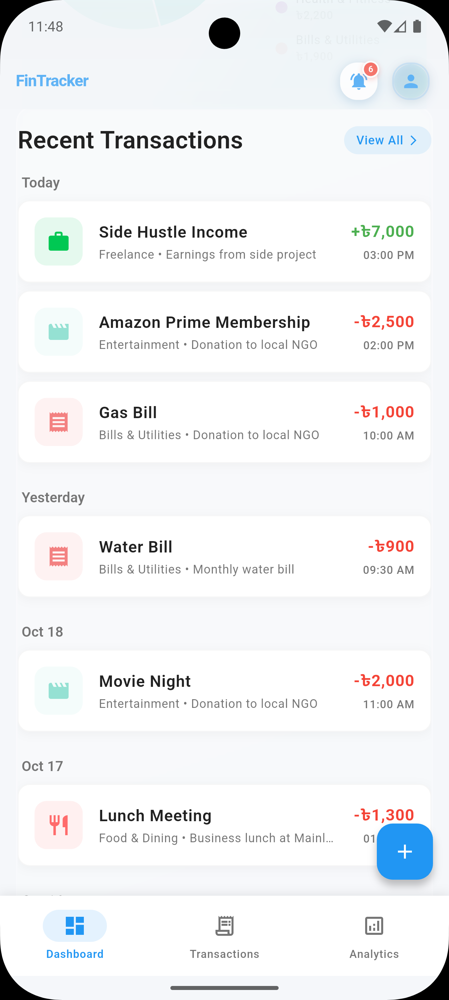
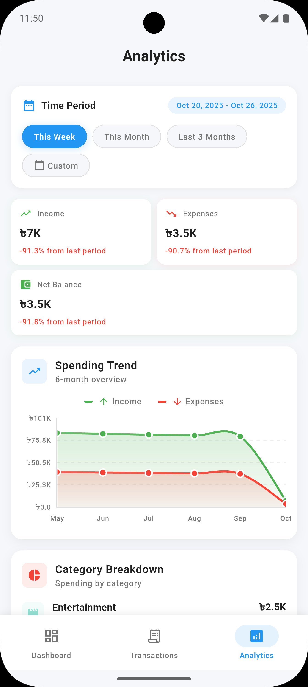
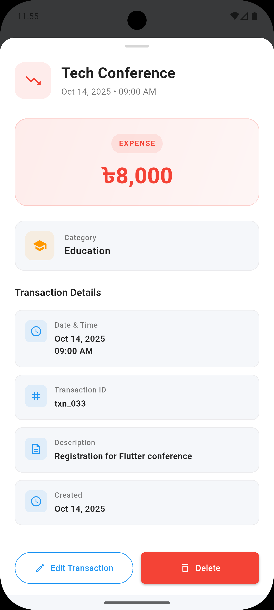

# FinTrack - Personal Finance Tracker

A clean and intuitive personal finance tracking application built with Flutter. Track income and expenses, visualize spending patterns, and monitor financial health with real-time analytics.

### Prerequisites
- Flutter SDK version 3.35.1
- Dart SDK version 3.9.0
- Android Studio or VS Code with Flutter extensions
- iOS Simulator, Android Emulator, or physical device

### Getting Started
1. Clone the repository:
   ```bash
   git clone https://github.com/sohailmahmud/techcare-flutter-assessment-sohail.git
   cd techcare-flutter-assessment-sohail
   ```

2. Install dependencies:
   ```bash
   flutter pub get
   ```

3. Generate required files:
   ```bash
   flutter packages pub run build_runner build
   ```

4. Run the app:
   ```bash
   flutter run
   ```

### Platform Requirements
- **iOS**: Version 13.0 or higher
- **Android**: API level 24 (Android 7.0) or higher

No additional permissions or configurations are required.

## Architecture Overview

This app follows Clean Architecture principles with clear separation between layers:

### Project Structure
```
lib/
├── core/                   # Shared utilities and components
├── data/                   # Data access and storage
├── domain/                 # Business logic and entities
└── presentation/           # UI components and screens
```

**Clean Architecture**: Separates business logic from UI and data concerns, making the code maintainable and testable.

**BLoC Pattern**: Manages application state predictably with event-driven updates and clear data flow.

**Repository Pattern**: Provides a clean interface between business logic and data sources, supporting both local and potential remote data.

## Key Features

### Core Functionality
- **Transaction Management**: Add, edit, and delete income/expense transactions with categorization
- **Real-time Analytics**: Dynamic charts showing spending patterns and trends
- **Category System**: Organize transactions with customizable categories and colors
- **Dashboard Overview**: Quick balance summary and recent transaction history
- **Period Filtering**: View data by day, week, month, or year

### User Experience
- **Offline Support**: All data stored locally for instant access
- **Responsive Design**: Works seamlessly across different screen sizes
- **Form Validation**: Smart input validation with helpful error messages
- **Smooth Animations**: Polished transitions and interactive elements

## Technical Decisions

### State Management with BLoC
I chose flutter_bloc for state management because it provides predictable state transitions and excellent testing support. The event-driven architecture makes it easy to understand how data flows through the app.

### Local Storage with Hive
Hive was selected for local storage due to its performance and simplicity. It's a lightweight NoSQL database that doesn't require native dependencies, making it perfect for a mobile finance app that needs fast, reliable data access.

### Navigation with go_router
The go_router package provides type-safe routing and better deep linking support compared to Flutter's built-in navigation. This makes the app more maintainable and provides a better user experience.

### UI Library Choices
- **fl_chart**: For interactive charts and data visualization
- **Material Design**: Following Google's design principles for familiarity

## Challenges and Solutions

### Navigation State Management
**Challenge**: Maintaining form state across complex navigation flows while keeping the bottom navigation persistent.

**Solution**: Implemented go_router with shell routes to maintain navigation state and proper form data persistence across screens.

### Real-time Chart Performance
**Challenge**: Charts were laggy when updating frequently with new transaction data.

**Solution**: Optimized chart updates using BLoC's event transformers and implemented efficient data structures to minimize redraws.

### Form Validation Complexity
**Challenge**: Managing validation across multiple interdependent form fields with clear user feedback.

**Solution**: Created reusable validation patterns with centralized error state management and clear visual feedback.

### Data Consistency
**Challenge**: Ensuring data integrity between different screens and potential future API integration.

**Solution**: Implemented the Repository pattern with a Result type for consistent error handling and data flow.

### Current Limitations
- **Local Only**: No cloud synchronization or backup
- **Single Currency**: Only supports BDT currency format
- **No Export**: Cannot export data to CSV or PDF
- **Single User**: No multi-user support or authentication
- **Basic Budgeting**: Simple budget tracking without advanced alerts

### Future Improvements
- Cloud sync for data backup and multi-device access
- Multiple currency support for international users
- Data export functionality
- Recurring transaction automation
- Advanced budgeting with alerts and recommendations

## Screenshots

<table>
  <tr>
    <td width="33%">
      
      <p align="center"><strong>1. Dashboard Overview</strong><br/>Main dashboard with balance overview and recent transactions</p>
    </td>
    <td width="33%">
      
      <p align="center"><strong>2. Recent Transactions</strong><br/>Quick access to latest transaction history</p>
    </td>
    <td width="33%">
      
      <p align="center"><strong>3. Analytics</strong><br/>Interactive charts with spending analysis</p>
    </td>
  </tr>
  <tr>
    <td width="33%">
      
      <p align="center"><strong>4. Transactions History</strong><br/>Complete transaction list with filtering</p>
    </td>
    <td width="33%">
      
      <p align="center"><strong>5. Transaction Form Add</strong><br/>Clean form for adding new transactions</p>
    </td>
    <td width="33%">
      
      <p align="center"><strong>6. Transaction Form Edit</strong><br/>Edit existing transactions easily</p>
    </td>
  </tr>
  <tr>
    <td width="33%">
      
      <p align="center"><strong>7. Transaction Details Modal</strong><br/>Detailed view with edit and delete options</p>
    </td>
    <td width="33%">
      
      <p align="center"><strong>8. Category Breakdown</strong><br/>Visual spending analysis by categories</p>
    </td>
    <td width="33%">
      
      <p align="center"><strong>9. Budget Overview</strong><br/>Budget tracking with progress indicators</p>
    </td>
  </tr>
</table>

*The screenshots showcase the app's clean design and intuitive user interface across all major features.*

## Time Spent

**Total Development Time: 18 Hours**

### Day 1 - Foundation (5 hours)
- Project architecture and setup
- Core entity design and data models
- Basic UI components and theming
- BLoC state management implementation

### Day 2 - Core Features (8 hours)
- Transaction form with validation
- Dashboard and analytics screens
- Navigation system setup
- Category management implementation

### Day 3 - Polish and Testing (5 hours)
- Comprehensive test suite (218 passing tests)
- UI/UX refinements and animations
- Bug fixes and performance optimization
- Documentation and code cleanup

### Major Milestones
- **Day 1**: Architecture, data layer and Basic UI components completed
- **Day 2**: Basic CRUD operations and Analytics dashboard with charts functional
- **Day 3**: Navigation, form validation, testing and documentation finished
